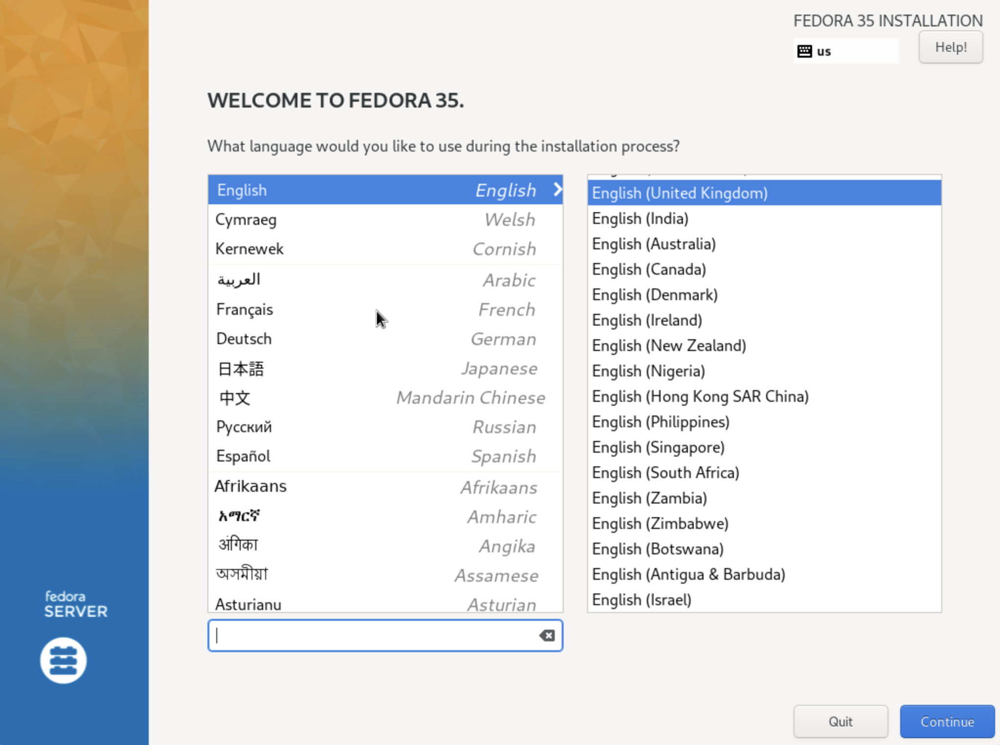
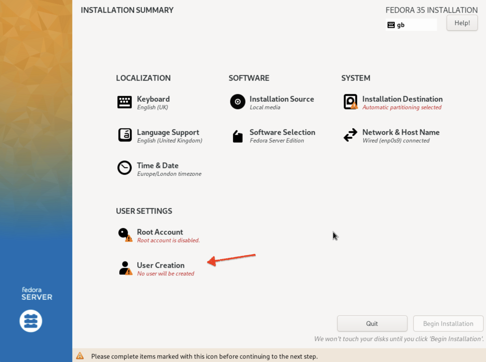
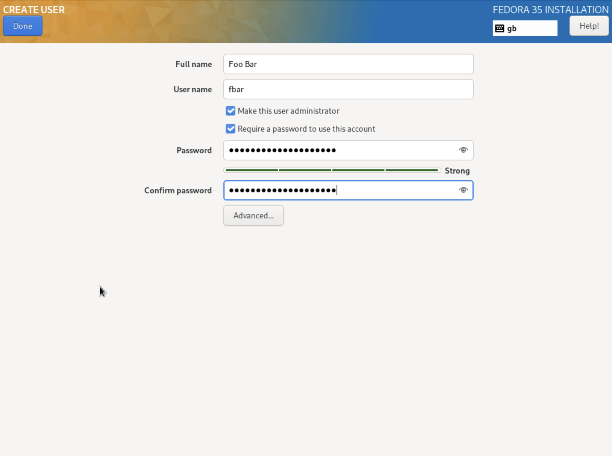
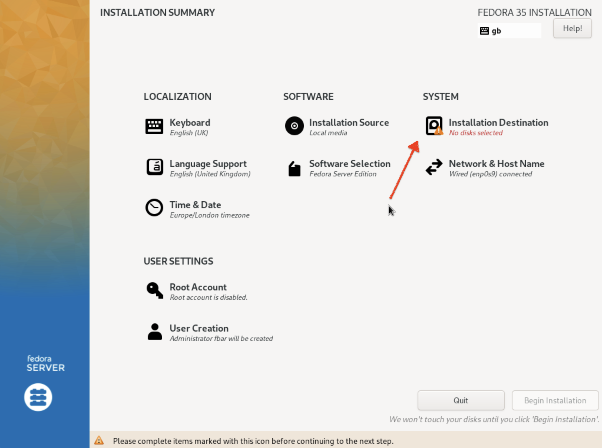
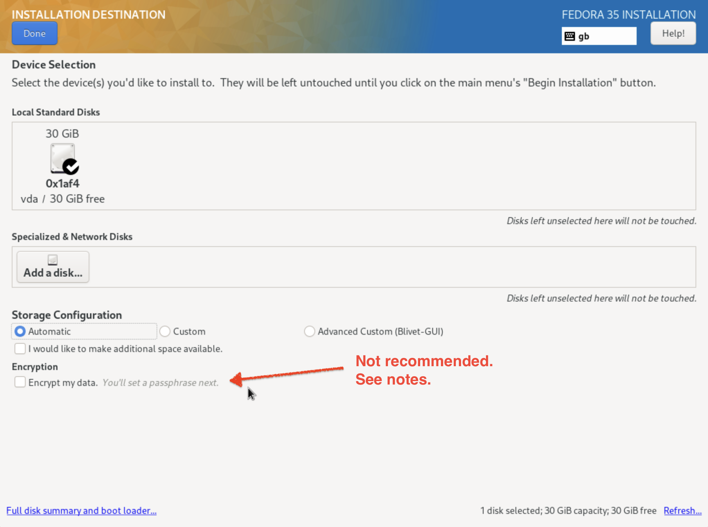
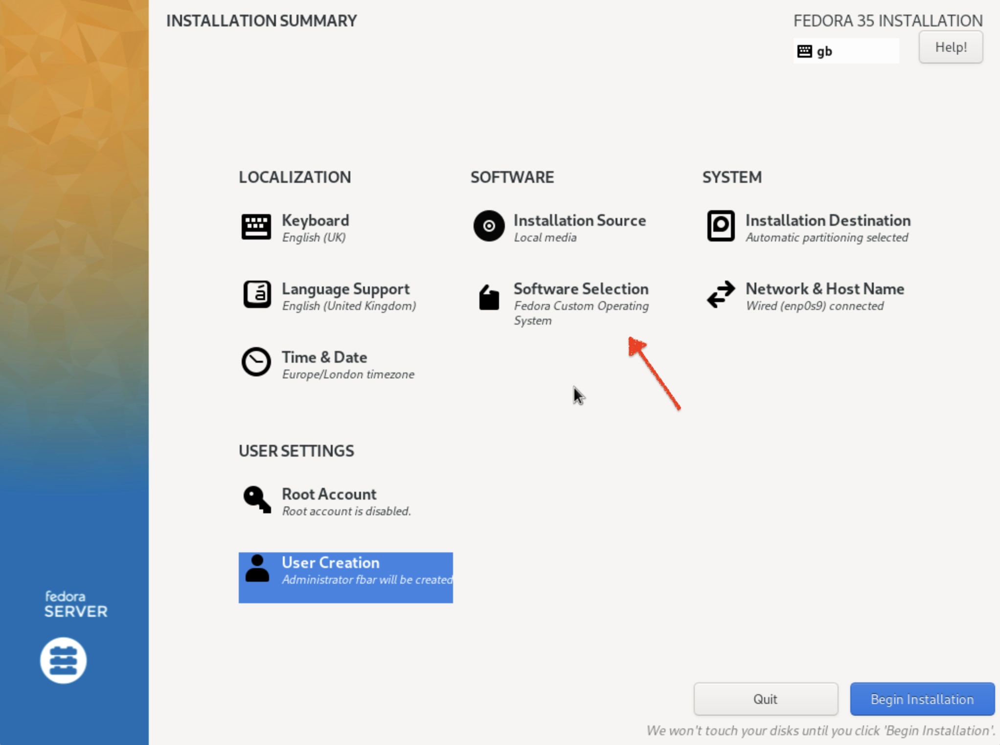
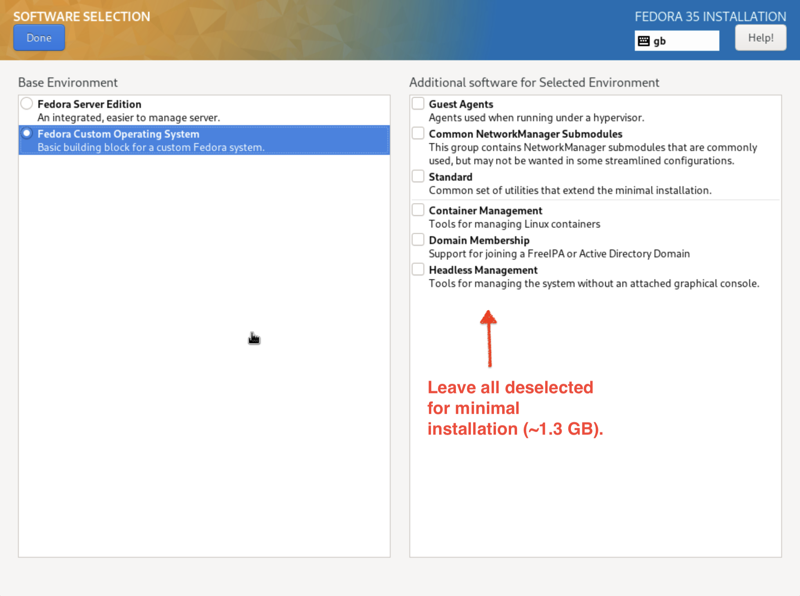

Install minimal version of Fedora server:

* Standard server image: <https://getfedora.org/en/server/download/>

* Create a VM with at least 3 GB RAM and 30 GB storage

* Keyboard: accept defaults

  

* Create an admin user:

  

  

* Configure disk. It is not recommended to encrypt the device, as it reduces
  the ability to compress the machine backup. Encrypting the backups is instead
  advised.

  

  

* Choose the minimal installation (~1.3 GB):

  

  

  

* Complete:

  

Get VM's local IP to log in via SSH:

    ip addr show

Add public key to allow password-less SSH login:

    mkdir ~/.ssh
    cat > ~/.ssh/authorized_keys # then paste public key, press <enter> and <ctrl-D>

Enable password-less sudo:

    sudo visudo # then uncomment the line '%wheel ALL=(ALL) NOPASSWD: ALL'

Prepare for installations:

    sudo dnf update

    sudo dnf remove -y vim-minimal

Install tools:

    sudo dnf install -y \
      bat \
      direnv \
      exa \
      fd-find \
      git \
      git-delta \
      glibc \
      groff \
      htop \
      jq \
      lsof \
      make \
      mtr \
      nmap \
      nnn \
      nodejs \
      ntpsec \
      openssl \
      pbzip2 \
      pigz \
      pipx \
      ripgrep \
      rsync \
      ruby \
      sqlite \
      tar \
      tmux \
      unzip \
      util-linux-user \
      vim-enhanced \
      wget \
      yarnpkg \
      zip \
      zoxide \
      zsh

Install FZF (terminal fuzzy-finder):

    git clone --depth 1 https://github.com/junegunn/fzf.git ~/.fzf
    ~/.fzf/install --all --no-update-rc --key-bindings --completion

Install git utilities:

    pipx install git-remote-codecommit
    pipx install pre-commit

Install `ruby-install`, a tool install different Ruby versions for the current
user:

    wget -O ruby-install-0.8.3.tar.gz https://github.com/postmodern/ruby-install/archive/v0.8.3.tar.gz
    tar -xzvf ruby-install-0.8.3.tar.gz
    cd ruby-install-0.8.3/
    sudo make install

Install dotfiles (optional, but recommended as a highly curated set of settings
for a development environment, including Vim, Tmux, zsh and all the terminal
utilities:)

    git clone git@github.com:bravoecho/dotfiles.git ~/workspace/dotfiles
    cd ~/workspace/dotfiles
    ./scripts/golang
    ./scripts/dotfiles
    ./scripts/vim

    ./scripts/ohmyzsh
    chsh -s $(which zsh)

Install the AWS command line tools:

    cd
    curl "https://awscli.amazonaws.com/awscli-exe-linux-aarch64.zip" -o "awscliv2.zip"
    unzip awscliv2.zip
    sudo ./aws/install

Install support for Samba directory sharing (not recommended, just move data
with `rsync` when needed:)

    sudo dnf install \
      samba \
      policycoreutils-python-utils
    sudo systemctl enable smb --now
    firewall-cmd --get-active-zones
    sudo firewall-cmd --permanent --zone=FedoraWorkstation --add-service=samba
    sudo firewall-cmd --reload
    sudo smbpasswd -a be11
    mdkir share
    mkdir share
    sudo semanage fcontext --add --type "samba_share_t" ~/share
    sudo restorecon -R ~/share
    sudo vim /etc/samba/smb.conf
    sudo systemctl restart smb

Install Terraform:

    cd ~/Downloads
    wget https://releases.hashicorp.com/terraform/1.0.10/terraform_1.0.10_linux_arm64.zip
    unzip terraform_1.0.10_linux_arm64.zip
    mv terraform ~/.local/bin

Set up Docker (optional, as having a proper Linux setup allows to execute
practically everything natively:)

    sudo dnf remove \
      docker\
      docker-client\
      docker-client-latest\
      docker-common\
      docker-latest\
      docker-latest-logrotate\
      docker-logrotate\
      docker-selinux\
      docker-engine-selinux\
      docker-engine
    sudo dnf -y install dnf-plugins-core
    sudo dnf config-manager --add-repo https://download.docker.com/linux/fedora/docker-ce.repo
    sudo dnf install docker-ce docker-ce-cli containerd.io
    sudo systemctl start docker
    sudo docker run hello-world
    sudo usermod -aG docker $USER
    newgrp docker
    docker run hello-world

Synchronise system clock after suspending the host machine. Depending on the
virtualisation solution, putting the physical machine to sleep might cause the
clock in the virtual machine to get out of sync, causing problems with some
logins such as AWS. To resolve this issue run the following command once or
twice:

    sudo ntpdate pool.ntp.org
