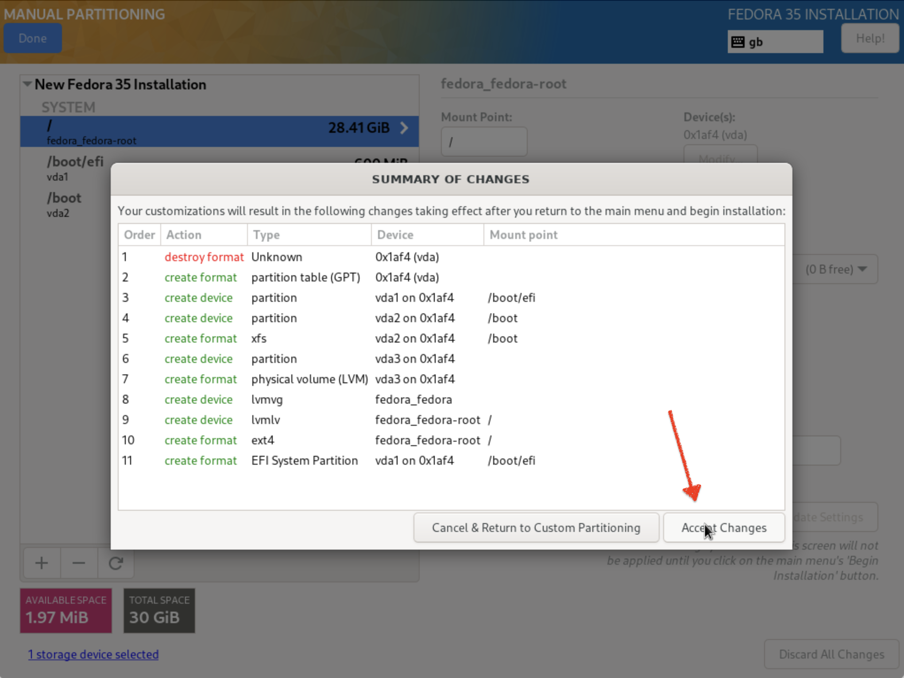

Installation
------------

Install minimal version of Fedora server.

### Download

Download the standard server image for your architecture. <https://getfedora.org/en/server/download/>

### RAM

Create a VM with at least 3 GB RAM and 30 GB storage.

### Keyboard

Accept default keyboard settings (most of the times the installer guesses them
correctly.)

### User

Create a nomal user, not a root account, and make it administrator.

### Disk configuration

By default the installer will only use half of the disk space when using
automatic partitioning. To fully utilise the virtual device we need to
customise the partitions.

Here we will assume that your virtual device is a 30 GB hard-drive.

Select "Custom" storage configuration and then on "Done".

Start by creating the base structure automatically.

Select the `ext4` filesystem (it's more efficient for a development
environment)

Use all the available space. First type `30 GiB` (or the size of the virtual
disk that you specified in your virtualisation solution) in the size field,
then select "Modify" > "As large as possible" and confirm.

It is not recommended to encrypt the device, as it reduces the ability to
compress the machine backup. Encrypting the backups is instead advised.

Select "Done" and accept the partitioning changes.

### Software selection

Choose the minimal installation (~1.3 GB):

### Summary

Begin installation.

Initial setup
-------------

Logging in from the virtualisation software terminal is only necessary once.
Log in, and get VM's local IP:

    ip addr show

Now, from the host's terminal, register the SSH keys:

    ssh-copy-id <username>@<ip-found-above>

This will copy the standard named keys from your `~/.ssh` directory, for
example `~/.ssh/id_ed25519.pub` and `~/.ssh/id_rsa.pub`.

Enable password-less sudo:

    sudo visudo # then uncomment the line '%wheel ALL=(ALL) NOPASSWD: ALL'

Prepare for installations:

    sudo dnf update

    sudo dnf remove -y vim-minimal

    sudo dnf upgrade

Reboot, as it will almost certainly have upgraded the kernel.

Remove old unused kernel(s):

    sudo dnf remove $(dnf repoquery --installonly --latest-limit=-1 -q)

Packages
--------

Install the most common tools up front available in the official repositories.

    sudo dnf install -y \
      bat \
      ctags \
      direnv \
      exa \
      fd-find \
      gcc \
      git \
      git-delta \
      glibc \
      groff \
      htop \
      jq \
      lsof \
      make \
      mlocate \
      mtr \
      nmap \
      nnn \
      nodejs \
      ntpsec \
      openssl \
      pbzip2 \
      pigz \
      pipx \
      podman \
      ripgrep \
      rsync \
      ruby \
      sqlite \
      tar \
      tig \
      tmux \
      tree \
      unzip \
      util-linux-user \
      vim-enhanced \
      wget \
      yarnpkg \
      zip \
      zoxide \
      zsh

Some applications still haven't updated to `python3.10`, and still rely on `python3.9`.

    sudo install python3.9 -y

and configure those apps to use 3.9.

Install FZF (terminal fuzzy-finder):

    git clone --depth 1 https://github.com/junegunn/fzf.git ~/.fzf
    ~/.fzf/install --all --no-update-rc --key-bindings --completion

Install git utilities:

    pipx install git-remote-codecommit
    pipx install pre-commit

Install `ruby-install`, a tool install different Ruby versions for the current
user:

    cd ~/Downloads
    wget -O ruby-install-0.8.3.tar.gz https://github.com/postmodern/ruby-install/archive/v0.8.3.tar.gz
    tar -xzvf ruby-install-0.8.3.tar.gz
    cd ruby-install-0.8.3/
    sudo make install
    cd ..
    rm ruby-install-0.8.3* -rf

Install dotfiles (optional, recommended)

    git clone git@github.com:bravoecho/dotfiles.git ~/workspace/dotfiles
    cd ~/workspace/dotfiles
    ./scripts/golang
    ./scripts/dotfiles
    ./scripts/vim
    ./scripts/ohmyzsh
    chsh -s $(which zsh)

Install the AWS command line tools:

    cd
    curl "https://awscli.amazonaws.com/awscli-exe-linux-aarch64.zip" -o "awscliv2.zip"
    unzip awscliv2.zip
    sudo ./aws/install

Install support for Samba directory sharing (not recommended, just move data
with `rsync` when needed:)

    sudo dnf install \
      samba \
      policycoreutils-python-utils
    sudo systemctl enable smb --now
    firewall-cmd --get-active-zones
    sudo firewall-cmd --permanent --zone=FedoraWorkstation --add-service=samba
    sudo firewall-cmd --reload
    sudo smbpasswd -a be11
    mdkir share
    mkdir share
    sudo semanage fcontext --add --type "samba_share_t" ~/share
    sudo restorecon -R ~/share
    sudo vim /etc/samba/smb.conf
    sudo systemctl restart smb

Install Terraform for your architecture:

    cd ~/Downloads
    wget https://releases.hashicorp.com/terraform/1.0.11/terraform_1.0.11_linux_arm64.zip
    unzip terraform_1.0.11_linux_arm64.zip
    mv terraform ~/.local/bin
    cd -

Set up Docker (optional, as having a proper Linux setup allows to execute
practically everything natively:)

    sudo dnf remove \
      docker\
      docker-client\
      docker-client-latest\
      docker-common\
      docker-latest\
      docker-latest-logrotate\
      docker-logrotate\
      docker-selinux\
      docker-engine-selinux\
      docker-engine
    sudo dnf -y install dnf-plugins-core
    sudo dnf config-manager --add-repo https://download.docker.com/linux/fedora/docker-ce.repo
    sudo dnf install docker-ce docker-ce-cli containerd.io
    sudo systemctl start docker
    sudo docker run hello-world
    sudo usermod -aG docker $USER
    newgrp docker
    docker run hello-world

Synchronise system clock after suspending the host machine. Depending on the
virtualisation solution, putting the physical machine to sleep might cause the
clock in the virtual machine to get out of sync, causing problems with some
logins such as AWS. To resolve this issue run the following command once or
twice:

    sudo ntpdate pool.ntp.org
